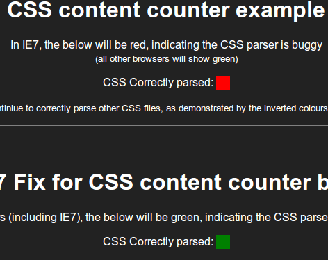

I came across a peculiar bug today while testing [theiconic.com.au](http://www.theiconic.com.au) in IE7;

```css
#foo:before {
  content: counter(item, '.') ': ';
}
```

Completely breaks IE7's CSS parser for the current .css file. ~The fix, as explained in [pragmar's answer on SO](http://stackoverflow.com/a/14983995/473961), is to add a space after 'item'.~ This is not the most optimal fix, and has the potential to break when minifying. The fix is to remove the space between the comma and the open quote. This is also safe for minification:

```css
#foo:before {
    /\* Note removing the space after ',' fixes IE7's CSS parser */
    content: counter(item,".") ": ";
}
```

This only occurs when using a quoted counter [list-style-type](http://www.w3.org/TR/CSS21/generate.html#counter-styles). Using 'open-quote', 'close-quote', etc, does not exhibit the bug. Check out the example below for a practical demonstration across browsers. Example: [IE7's CSS breaking content counter bug](/public/ie7counterbug/). [](/public/ie7counterbug/) Happy Coding!
