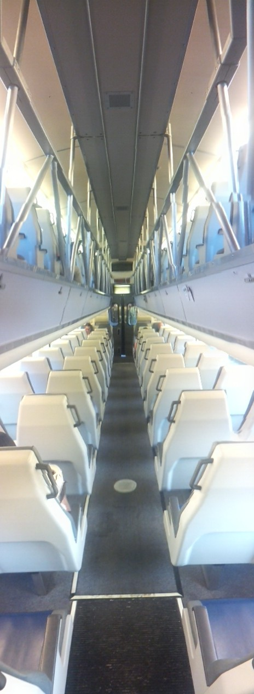

Bikes. Everywhere! Thought Sydney had a lot of cyclists? That's nothing on the huge number of people riding around the Bay Area!

Tech logos. Everywhere! In just one day, I saw people carrying/wearing logos for: Oracle, BitTorrent, Ebay, Dropbox, and (of course) Groupon! That was without me even trying to spot them.

I used the "I'm Australian" excuse only once! ... When approached by a man trying to sell his locally produced album, I refused by saying "I'm only really into Australian music, thanks anyway".

All the seats on the train face backwards. And the levels are split up weirdly.

Speaking of the train: There's no lines! Barely anyone seems to catch it (from my stops)... Maybe they're all cycling?

There's such a thing as "Moving Season" - mostly when all the students start to move in for the academic period. So, if I want to rent a place (which I do), I need to start looking now!

"Muggy" here is defined by 30% humidity... THIRTY PERCENT! I wish it was this "muggy" some days in Sydney :P

Free food rocks (with caveats). It's tasty, but probably not the healthiest, and it means I don't get outside during the day :(

Despite being all about equality, there is so much social segregation! For example; people grouped by a single characteristic (colour / geographic origin / sexuality), etc - I understand people grouping together under a common banner, but it's... different that in Australia.

Anyway, this is all just my first day at work... There's lots more where that came from!
